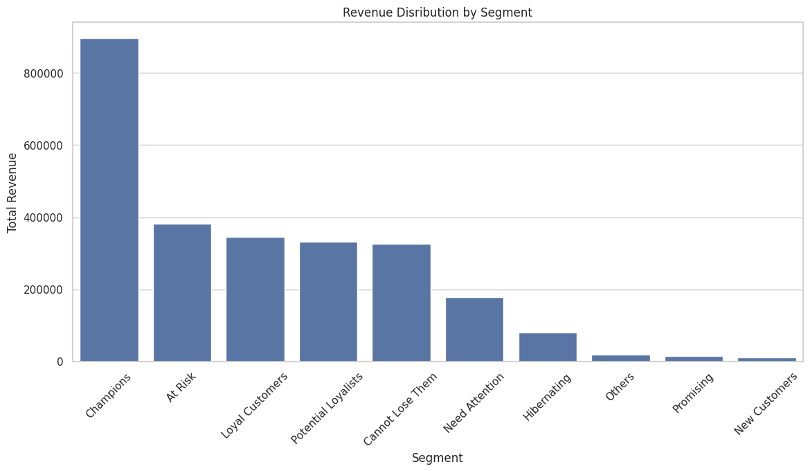
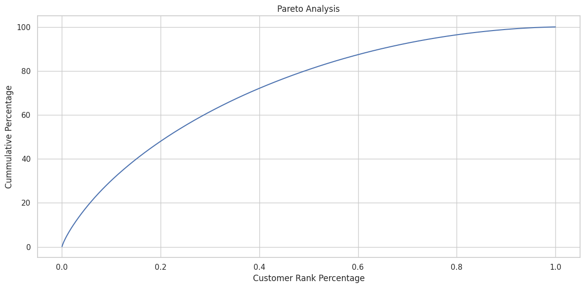
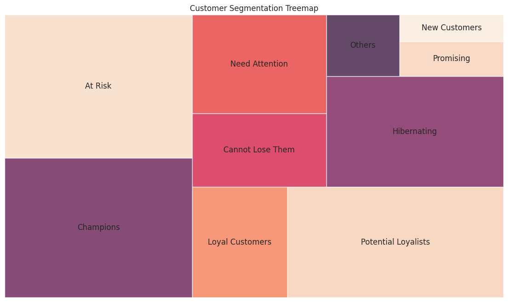
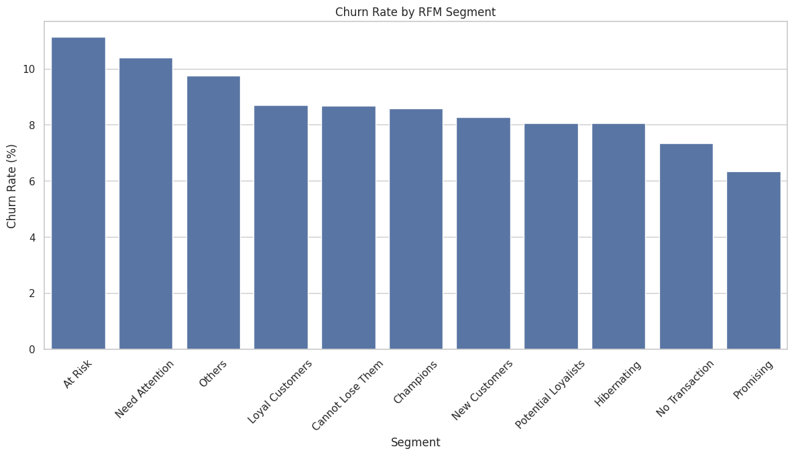

# RFM - Customer Segmentation & Retention Analysis

Analisis segmentasi pelanggan berbasis RFM (Recency, Frequency, Monetary)
pada 8,000 pelanggan e-commerce lintas 20 negara dan 14 kategori produk,
untuk mengidentifikasi pelanggan bernilai tinggi, memvalidasi risiko churn,
dan menyusun rekomendasi retensi & win-back campaign yang actionable.

## Business Problem

1. Bagaimana segmentasi pelanggan berdasarkan perilaku transaksi dapat
   digunakan untuk meningkatkan retensi pelanggan dan kontribusi pendapatan?
2. Bagaimana distribusi pelanggan berdasarkan nilai Recency, Frequency, dan Monetary?
3. Segmen pelanggan mana yang memberikan kontribusi pendapatan terbesar?
4. Segmen pelanggan mana yang memiliki risiko churn tertinggi?
5. Membership tier dan acquisition channel mana yang menghasilkan pelanggan paling bernilai?
6. Produk dan kategori apa yang paling banyak diminati oleh pelanggan bernilai tinggi?
7. Pelanggan mana yang harus diprioritaskan untuk program retensi dan win-back campaign?

## Dataset

25,000 order dari 8,000 pelanggan, 20 negara, 14 kategori produk, dengan
histori transaksi lengkap, churn label, membership tier, acquisition
channel, dan tren revenue bulanan selama 6 tahun (2020-2026).

## Metodologi

1. **Data cleaning** — pengecekan missing value & duplikat
2. **RFM scoring** — Recency, Frequency, Monetary dihitung per pelanggan,
   diskoring dengan kuantil (1-5), lalu dikelompokkan jadi **9 segmen**
   (Champions, Loyal Customers, Potential Loyalists, Promising, Need
   Attention, Cannot Lose Them, At Risk, Hibernating, New Customers)
3. **Validasi silang** — segmen RFM divalidasi terhadap **churn label
   aktual** (bukan asumsi), serta dianalisis lintas membership tier,
   acquisition channel, dan kategori produk

## Key Findings

**Revenue sangat terkonsentrasi**


Champions hanya 18.6% dari total pelanggan, tapi menyumbang **34.7%**
total revenue. Analisis Pareto mengonfirmasi: top 20% pelanggan
menyumbang **48.05%** revenue.



**Distribusi 9 segmen pelanggan**


**Risiko churn tidak sesederhana "value tinggi = aman"**


Segmen **At Risk** (11.1%) dan **Need Attention** (10.4%) punya churn
rate tertinggi. Tapi menariknya, churn rate Champions (8.6%) tidak jauh
beda dari rata-rata segmen lain — pelanggan bernilai tinggi tetap perlu
dijaga proaktif, bukan dianggap otomatis aman dari risiko churn.

**Acquisition channel paling bernilai**


**Organic Search** unggul dari sisi revenue per customer ($355), churn
rate terendah (7.9%), dan volume pelanggan besar (2,019 orang) —
menjadikannya channel paling bernilai secara keseluruhan, mengalahkan
Paid Ad maupun Referral.

**Temuan lain:**
- Membership tier (Free/Silver/Gold/Platinum) ternyata **tidak banyak
  membedakan value pelanggan** (avg monetary berkisar $342-355 di semua
  tier) — sinyal program membership belum efektif mendorong spending
  lebih besar di tier atas.
- Kategori **Electronics** paling diminati pelanggan bernilai tinggi
  (Champions & Loyal Customers), disusul Clothing & Apparel dan Home & Kitchen.

## Rekomendasi Aksi per Segmen

| Segmen | Aksi Utama |
|---|---|
| Champions | Program VIP & loyalty rewards, early access produk baru, referral program |
| Loyal Customers | Cross-selling/upselling, dorong naik membership tier |
| At Risk | Reactivation campaign, voucher terbatas, prioritas ke monetary tinggi |
| Cannot Lose Them | Personal outreach, benefit eksklusif, evaluasi pengalaman terakhir |
| Hibernating | Win-back campaign biaya terkendali, hindari diskon besar untuk nilai historis rendah |

**Prioritisasi retensi** — 2,720 pelanggan di segmen At Risk/Cannot Lose
Them/Need Attention jadi prioritas retention campaign; **1,925 pelanggan**
Champions/Loyal Customers jadi target program VIP untuk menjaga
loyalitas (bukan win-back).

## Tools

Python (pandas, numpy, matplotlib, seaborn, squarify) untuk RFM scoring,
segmentasi, dan visualisasi.

## Repo Structure

```
├── RFM_Customer_Segmentation___Retention_Analysis.ipynb
├── images/
├── data/          # customers.csv, orders.csv, monthly_revenue.csv, product_summary.csv
└── README.md
```

## How to Run

```bash
pip install pandas numpy matplotlib seaborn squarify
jupyter notebook RFM_Customer_Segmentation___Retention_Analysis.ipynb
```

---
*Dataset digunakan untuk tujuan pembelajaran/portofolio.*
